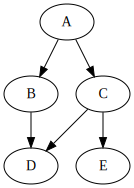

I've been using Rake more and more for data collection and processing tasks.  Rake is pretty pretty powerful.  Most people know it as way to add external tasks to a Rails app, but it's actually very powerful build system.  We're going to take advantage of that to build out a [framework](https://github.com/HappyFunCorp/rake-data) that will make it easy to collect, process, and interpret data while keeping it all in sync.

In fact, if you just want to start playing with stuff now, head over to the [rake-data](https://github.com/HappyFunCorp/rake-data) site to go through some walk throughs.  Read on to setup a fun world of your own!

## Rejected titles of this post

- rake and bake
- rake me up before you go-go
- let them eat rake
- rake it until you make it


## Tasks and Dependancies

Rake is a a Make-like Ruby program that people know mostly in terms of rails apps.  We can define a few tasks and define their interdependancies:


```ruby
task :mail_daily_leader_boards => :update_leader_boards do
  User.mail_leader_boards!
end

task :flush_data => :environment do
  Leaderboard.flush!
end

task :update_leader_boards => :environment do
  Leaderboard.update!
end

task :environment
```

When we run `mail_daily_leaderboards` it makes sure that `update_leader_boards` is run first.  This in turn depends upon `environment`, and Rake makes sure that all dependancies are met before executing the task.

```bash
$ rake mail_daily_leaderboards --dry-run
** Invoke mail_daily_leader_boards (first_time)
** Invoke update_leader_boards (first_time)
** Invoke environment (first_time)
** Execute (dry run) environment
** Execute (dry run) update_leader_boards
** Execute (dry run) mail_daily_leader_boards
```

Rake is also smart enough to only run a task once.  Lets look at what happens when we try to run two tasks:

```bash
$ rake flush_data mail_daily_leader_boards --dry-run
** Invoke flush_data (first_time)
** Invoke environment (first_time)
** Execute (dry run) environment
** Execute (dry run) flush_data
** Invoke mail_daily_leader_boards (first_time)
** Invoke update_leader_boards (first_time)
** Invoke environment
** Execute (dry run) update_leader_boards
** Execute (dry run) mail_daily_leader_boards
```

Notice here that even though `update_leader_boards` and `flush_data` both depend on `environment`, so it needs to be run for either of the dependant tasks to run, and it is only invoked once.

So far so good.

## Dataflow programming

So Rake gives us a dependancy specification and resolution process.  We can visualize this in two ways.  One way is where the arrows are pointing to sub tasks, top down, where the arrow direction represents the control flow control of the process.  When you want A, it makes sure that B and C are there, which in turn have their own dependancies.

What does it mean if we were to reverse the arrows on the graph?

<table class="table table-bordered">
  <tr>
    <th style="text-align: center">Top Down</th>
    <th style="text-align: center">Bottom Up</th>
  </tr>

  <tr>
    <td style="text-align: center">
    
    </td>

    <td style="text-align: center">
    
    </td>
  </tr>
</table>

If we think about rake in terms of managing a build process, what we called _dependancies_ are actually the source of the data.  If we want an object file, we start with the source file.  If we want to generate C, we need to have generated the data for D and E.

## File Tasks

Rake also knows about building files.  `Rake::FileTask` is a subtask of `Rake::Task` which will only run the target if the _file is out of date_ : if the source file is newer than the destination file.

```ruby
file "Rakefile.gz" => "Rakefile" do |task|
  sh "gzip -fkv #{task.source}"
end
```

This defined as task called `Rakefile.gz` that when invoked will look to see if either the file doesn't exist, or if it's older than the source file `Rakefile`, and gzips it up.

```bash
$ rake Rakefile.gz
gzip -fkv Rakefile
Rakefile:   -20.6% -- replaced with Rakefile.gz
```

Run it again and nothing happens!

```bash
$ rake Rakefile.gz
$
```

Touch the source file and it gets rebuilt:

```bash
$ touch Rakefile
$ rake Rakefile.gz
gzip -fkv Rakefile
Rakefile:   -20.6% -- replaced with Rakefile.gz
```

## Rake as a build system

Files and rules come from Rake's `make` heritage.  We can think of regular `Task`s as being a general sort of _action_, meaning you are packaging up certain set of imperitives in a particular context to achieve some goal.  `FileTask`s are a more specific type of action, where we want to generate a specific file from a specific source file.  For a full build system we want to be able to translate whole classes of files into other files, like source files into object files, or XML files into HTML files.  We use `Rules` to set these up.

## Tasks defined as Rules

The third main bit of magic that Rake gives us is rules.  The file task can magically bring a file into being when invoked, but in a build process its more common to translate files with a certain extention to other files in a different extension.  The canonical example is probably compiling `.c` source files into `.o` objects, but since it's the 21 first century lets look at how to run the Graphviz dot file to process into svg or.dot.svg files.

```ruby
rule ".svg" => ".dot" do |task|
  sh "dot -Tsvg < #{task.source} > #{task}"
end

rule ".dot.svg" => ".dot" do |task|
  sh "dot -.dot.svg < #{task.source} > #{task}"
end
```

Now we can ask Rake to build a _type_ of file, and will look for a source file based upon the name that you request.  For example, if we were to run the command:

```bash
$ rake bottom.svg
dot -Tsvg < bottom.dot > bottom.svg
$
```

Rake would try to instantiate the file `bottom.svg` by first requesting file called `bottom.dot`.  Since this is part of the rake dependancy system, this could in turn be built by a seperate rake task!

Note that Rake doesn't know anything specifically about these extension.  It just knows what you have defined.  We can define other formats and build rules around that.


## Using Rake to pull data from a url

Let's extend the Rake DSL to be able to download files from the internet.  You can put this at the top of your `Rakefile` for now.

```ruby
def url( dest, source )
  file dest do
    puts "Loading #{source}"
    if !File.exists?( dest )
      mkdir_p dest.to_s.pathmap( "%d" )
      sh "curl -L '#{source}' > #{dest}"
    end
  end
end
```

Lets use this to download a file from the internet do we can parse it.

```ruby
url "source/weather.json", "http://api.openweathermap.org/data/2.5/weather?id=5128581"
```

When we run `rake source/weather.json` the first time, the file is downloaded.  The second time we run the rake command nothing happens since the `source/weather.json` file already exists.  Lets add a quick task to parse the JSON.

## Parse JSON using simple ruby commands

Lets parse the file:

```ruby
require 'json'
file "report.txt" => "source/weather.json" do |task|
  puts "Parsing sun times"
  data = JSON.parse( File.read( task.source ))
  File.open( task.to_s, "wb" ) do |out|
    out.printf "%-15s %s\n", 'sunrise', Time.at( data['sys']['sunrise'] )
    out.printf "%-15s %s\n", 'sunset',  Time.at( data['sys']['sunset'] )
  end
end
```

Run `rake report.txt`.  This should generate the file the first time, and on subsequent runs, do nothing.  If you remove `source/weather.json` file and run `rake report.txt` again, you'll see that Rake is smart enough to download a new version of the file.

## Parsing HTML

Another common thing to do is to download a webpage and parse through the results.  `Nokogiri` makes this really easy since you can identify DOM elements using CSS selectors more or less the same a jQuery selectors.

Lets make a function to help us parse html files into CSV files:

```ruby
# Parse an HTML file into CSV
def parse_html( dest, source, &parser )
  require 'nokogiri'
  require 'csv'

  file dest => source do
    puts "Parsing #{source} -> #{dest}"
    mkdir_p dest.to_s.pathmap( "%d" )

    html = Nokogiri.parse( File.read( source ) )
    CSV.open( dest.to_s, "wb" ) do |csv|
      parser.call( html, csv )
    end
  end
end
```

This defines a file task to convert one file type into another.  When it needs to run -- and this will only happen of the source file changes or the destination file doesnt exist -- it loads up the file into Nokogiri, creates a CSV output file, and passes control to a passed in block for processing.

Let's pull out a list of the top 10 popular books on project gutenberg for the last month:

```ruby
# Load the html file with statistics
url "source/top.html", "http://www.gutenberg.org/browse/scores/top"

parse_html "processed/month_top_100.csv", "source/top.html" do |html,out|
  html.css( "h2#books-last30 + ol a" ).each do |link|
    out << [link['href'],link.content]
  end
end

file "processed/month_top_10.csv" => "processed/month_top_100.csv" do |task|
  sh "head -n 10 #{task.source} > #{task}"
end
```

And now run `rake processed/month_top_10.csv` and watch what happens.  This only hits the server the first time it's run.  If we want to process things again, we simply delete the files in the `source` directory and everything in the `processed` directory will get regenerated.

## Tasks over multiple files

We have a few CSV files that contain a list of books.  How would we do something with these books?  The natural thing would be to use Rake's `FileList`, but this doesn't work the way you'd expect because `FileList` caches its results and it therefor doesn't know about files that are created during the build process.  We don't want to have to run rake twice to get our results, we want to be able to trust the process!

Let's extend the DSL again to add a command that will loop over a file and call our block for each line:

```ruby
# Loop over a file and yield the block for each line
# If name ends with .csv, parse the csv and yield each line
def file_loop( name, source )
  task name => source do
    if source =~ /.csv$/
      CSV.open( source ).each do |line|
        yield line
      end
    else
      File.readlines( source ).each do |line|
        yield line
      end
    end
  end
end
```

Now we can use this to create a task that goes through each of the lines of the file.  We'll do this to define url tasks for the file and then immediately invoke them so make sure that the file was loaded.

```ruby
# Loop through the top ten books and make sure that they exist
file_loop "processed/top_10_books_text", "processed/month_top_10.csv" do |line|
  path = "#{line[0].gsub( /^\//, "" )}.txt"
  puts path
  url( path, "http://www.gutenberg.org/#{path}.utf-8")
  Rake::Task[path].invoke
end
```

Running `rake processed/top_10_books_text` will first make sure that `processed/month_top_10.csv` is up-to-date, doing whatever it needs too to make it happen, and then loop through each of the lines and download the ebook file.

_Note, we are going to be making a bunch of requests to the Project Gutenberg website, a total of 11 in all.  You might be flagged as a bot, so take a look at the generated `.txt` files to make sure that they actually contain the book content. **But no matter how many times you run your commands, unless you delete the downloaded files there will be no more than 11 requests to the server!**_

## Using rules to parse data

Lets create a rule that will give us a count of all the words in a book:

```ruby
# Count and sort the list of words
rule ".word_count" => ".words" do |dest|
  sh "cat #{dest.source} | sort | uniq -c | sort -nr> #{dest}"
end
```

If we try to run this now, say `rake ebooks/1342.word_count` we'll get an error saying it doesn't know how to build that file.  Let's add a rule to go from `.txt` to `.words`:

```ruby
# Covert txt to words
rule ".words" => ".txt" do |dest|
  sh "cat #{dest.source} | tr -cs '[:alpha:]' '\n' | tr '[:upper:]' '[:lower:]' > #{dest}"
end
```

Now when we run it, we first generate a list of words, and then from that we find the unique count of them.

## Get your own rake-data

It's simple enough to setup this on your own, but I've put together a few useful things that I've been using to process data into it's own gem.  You should head over to https://github.com/HappyFunCorp/rake-data now to check it out!

Other things to check out:

- http://blog.kaggle.com/2012/10/15/make-for-data-scientists/
- http://blog.factual.com/introducing-drake-a-kind-of-make-for-data
- http://datascienceatthecommandline.com
