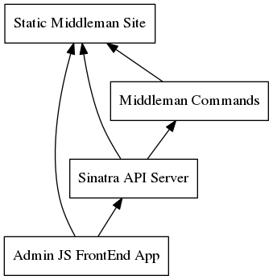

Can we make static site generators work like a normal site? Lets take a look at how we'd start to implement [Slow Data and Fast Sites](/slow-data-and-fast-sites/) using the example of building an admin UI for a Middleman blog.

## TLDR

Given a middleman app with `middleman-blog` and `middleman-blog-drafts` configured:

1. Add `middleman-blog-ui` in your `Gemfile`.  _This document describes how `middleman-blog-ui` works._
2. Add `activate :blog_ui` in `config.rb`
3. Start `middleman server`
4. Visit [http://localhost:4567/admin](http://localhost:4567/admin).

And now you are living in the fabulous world where you can, from your browser:

- Edit existing drafts and posts
- Create new drafts
- Publish drafts into posts
- Run some basic `git` commands.
- Run `middleman build`
- Run `middleman deploy`

## Why do this

This is explained in more detail in the  [Slow Data and Fast Sites](/slow-data-and-fast-sites/) post, but basically what we're trying to do it seperate out runtime tooling with development time tooling.  _Future work will be around differentiating when components are rendered and from which data source._

Static sites have a huge runtime benefit, but actually setting them up and running them can [really suck unless you already know how to do it](http://veekaybee.github.io/static-sites-suck/).  This is a proof of concept of how to add a CMS to a static site so that it's easier to manage.  This doesn't address the "pain in the ass to setup" part, but it helps with the usability.

Lets walk through what we're doing if we were to implement this in your own app directly.  The gem packages this up with a slightly different directory scheme, but the code below is the same but slightly easier to understand.

## The basic idea

We're going to add a static JavaScript application in the `source/admin` directory which will interact with the local filesystem and middleman install.  This application will consume data from your middleman app on the local system, in the "development" environment, such as the lists of published and draft articles, and will interact with a API server that will be mounted as part of the middleman preview server.  This will allow the Javascript app to change the filesystem, which will in turn be monitored and rendered by the middleman application.  

Examples of the commands that can be triggered are:

- create new draft
- publish draft into article
- `git status`
- `bundle exec middleman build`




Let go through each of the components as if we were building them in our app directly.  The `gem` does a lot of this for you, but it's always nice to see how it works.

## Static Middleman Site

We're going to add our files in `source/admin`, and `source/javascript/admin` and `source/stylesheets/admin.scss`.  All of these files will be rendered in development mode, so when the server is running locally and you load up [http://localhost:4567/admin](http://localhost:4567/admin) we can use the middleman build process to load up our UI.  This, in turn, will use AJAX to pull in data from the running middleman instance.

Inside of `config.rb`, we tell middleman about our pages, and we tell the build process to ignore these files as part of the build process since we don't want to release them into production:

```ruby
page "/admin/*html", layout: "admin/layout"

# Build-specific configuration
configure :build do
  ignore '/admin/*'
  ignore '/stylesheets/admin/*'
  ignore '/javascripts/admin/*'
end
```

If they were not ignored, then you would be deploying a read-only version of the admin tools, since the production build would include the javascript application but not the API which is needed to make changes.

This will allow us to create files like `/source/admin/drafts.json.erb`:

```erb
<%% d = drafts.collect do |d|
    { path: d.path, title: d.title }
  end
%><%%=
  {drafts: d }.to_json
%>
```

That we can load from our JS app like:

```js
$.get( '/admin/drafts.json' ).then( function( data ) { console.log( data ) } );
```

Note that when we do `middleman build` these files _will not_ be generated, since we've specified them as `ignore`.  These files only are in the `:development` environment.

## The Sinatra App

That's fine for static data, or data that can be exposed using normal middleman ways of doing things, but we'll also want to be able to interact with the filesystem and run commands.  It's also going to be useful to interact with the middleman _Sitemap_ as it understands it, so we can build a simple sinatra app that acts as a bridge.  The current version of the code I'm using for this blog can be found [on github](https://github.com/HappyFunCorp/middleman-blog-ui/blob/master/lib/middleman/blog/ui/api_server.rb).

First we need to `require` and `mount` our app on `config.rb`.  This is done like so:

```ruby
require 'lib/apiserver.rb'

map "/api" do
  run ApiServer
end
```

The commands we want to support are:

- `get /api/post` - load a specific post and metadata
- `post /api/post` - save a post and update metadata
- `post /api/images` - upload an image (for drag and drop) (not implemented)
- `post /api/draft` - create a new draft post
- `post /api/publish` - change a draft into an article
- `post /api/update` - run `git pull origin master 2>&1`
- `post /api/diff` - run `git diff 2>$1`
- `post /api/status` - run `git status 2>&1`
- `post /api/build` - run `bundle exec middleman build 2>&1`
- `post /api/deploy` - run `bundle exec middleman deploy 2>&1`

To reiterate right now the code is in more of a proof of concept, butso please feel free to make suggestions. Lets take a look at a few of these methods in `lib/api_server.rb`:

```ruby
require 'sinatra/base'
require 'sinatra/json'

class ApiServer < Sinatra::Base
  get '/' do
    "This is the api server"
  end

  get '/post' do
    app = load_app

    logger.info "Looking up #{params[:path]}"

    file = app.sitemap.find_resource_by_path params[:path] if params[:path]

    if !file
      status 404
      json error: "Unknown path #{params[:path]}"
    else
      raw = File.read file.source_file
      body = raw.gsub( /^---\n.*?---\n*/m, "" ) # Remove the preyaml

      json meta: file.data, content: body
    end
  end

  private
  def load_app
    opts = {}

    app = ::Middleman::Application.server.inst do
      set :environment, opts[:environment].to_sym if opts[:environment]

      logger
    end

    app
  end

  def logger
    ::Middleman::Logger.singleton( 1 )
  end
end
```

## The Javascript App

I also wanted to see how to build this in [React](http://facebook.github.io/react/index.html) and [Reflux](https://github.com/reflux/refluxjs) to start exploring how we can start to add build-type rendering into the equation.  While this doesn't do any server side rendering, its still good to explore how a React app actually works.

The main html file simple calls `React.render( React.createElement(App, null), document.getElementById('content') );` to setup the page.  The [App](https://github.com/HappyFunCorp/middleman-blog-ui/blob/master/source/javascripts/admin/components/app.js.coffee) component works off of the [pathStore](https://github.com/HappyFunCorp/middleman-blog-ui/blob/master/source/javascripts/admin/stores/article.coffee) component, which keeps track of what page the user is currently editing.  Lets take a quick look at how the [DashboardDraftList](https://github.com/HappyFunCorp/middleman-blog-ui/blob/master/source/javascripts/admin/components/dashboard_draft_list.js.coffee) component works:

```coffeescript
@DashboardDraftList = React.createClass
  mixins: [Reflux.connect(draftStore)],

  getInitialState: ->
    drafts: []

  componentDidMount: -> updateDraftList()

  render: ->
    drafts = @state.drafts.map (item) ->
      <li key={item.path}><a onClick={viewPath.bind(this, item.path)}>{item.title}</a></li>

    <div className="maincontent">
      <h1>Drafts</h1>

      <ul className="nav nav-pills nav-stacked">
        {drafts}
      </ul>
    </div>
```

The first thing that this does is wire itself up to the `draftStore` store which manages the communication to the server and the state received from the server.  When this changes, `draftStore` will trigger a state change and all components that have been connected will receive a `setState` message, which will then call the `render` method of the component keeping the UI up to date.   As part of the React component life cycle `componentDidMount`, we call the `updateDraftList()` action when the component is first loaded on the page.  This is defined in [drafts store](https://github.com/HappyFunCorp/middleman-blog-ui/blob/master/source/javascripts/admin/stores/drafts.coffee):

```coffeescript
@updateDraftList = Reflux.createAction
  asyncResult: true

@draftStore = Reflux.createStore
  init: ->
    @drafts = []
    @listenTo( updateDraftList, @onUpdateDrafts )

  onUpdateDrafts: ->
    request.get "/admin/drafts.json", (err, response) =>
      if response.ok
        updateDraftList.completed( response.body )
        @drafts = response.body
        @trigger @drafts
      else
        updateDraftList.failed(response.error)
```

The first thing we do is to define and export a `Reflux` action called `updateDraftList`.  This action is what the `componentDidMount` function triggeres.  Inside of the `draftStore` we listen for that action, and when it get it, call `onUpdateDrafts`.  This uses request.get to load up the json from `/admin/drafts.json` and then pushes it out to all of the components that have subscribed to it.

The other components are [defined here](https://github.com/HappyFunCorp/middleman-blog-ui/tree/master/source/javascripts/admin/components) and the different stores can be [found here](https://github.com/HappyFunCorp/middleman-blog-ui/tree/master/source/javascripts/admin/stores).  This is my first real React app so I'm sure there's cleaner/better ways of doing things...

## Putting it all together

When I was working on this I did it out of the source directory of this blog, but I wanted to package it up into a gem so that other folks could use it.  I pulled the relavent code out from `willschenk.com/source` into `middleman-blog-ui/source` and then created a middleman extension to put the various templates in the sitemap, tell sprockets where to find the javascript files, and setup coffee script.

The [full code](https://github.com/HappyFunCorp/middleman-blog-ui/blob/master/lib/middleman/blog/ui/extension.rb) is found on github, but to explain how it works:

1. Define `SOURCE_DIR`
2. Map the sinatra app `ApiServer` in the extentions `initialize` method, using `app.map`.
3. Register the CoffeeScript processing using `::Sprockets.register_preprocessor 'application/javascript', ::Sprockets::CoffeeReact`
4. Use `after_configuration` to register the application templates, by creating `Middleman::Sitemap::Resource` objects mapping the sitemap urls with the filesytem paths.
5. Adding each of the javascript and stylesheet files to `app.sprockets`.

## Next steps

This is mainly a proof of concept, but I'm using it right now to write this post.  The app itself needs

1. A decent UI
2. Support for other static generators other than middleman
3. A concept of users
4. Shared drafts
5. Better error handling

If you are at all interested in this, please let me know!
