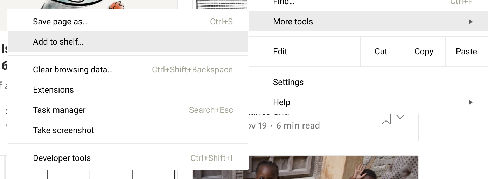

My experiment with the Chromebook has continued longer than I really expected. This machine is fun! Everything is so much faster and less cluttered, and I’m able to focus more.

This machine is something in between a laptop and a cellphone. Like a cellphone, it starts quickly, so dipping in and out is easy. Its just easy to grab the Chromebook to check something real quick, send out an email, whatever in the same way that unlocking your phone is easy. There’s also less distractions than a regular laptop since the UI basically assumes on big window that’s more or less full screen, again like a cell phone. No menu bar hovering over you, no desktop peeking out from behind, just one focused on one app.

But it’s got a lot of advantages of a laptop. The keyboard is nice so entering in text is obviously way easier if that’s what you do. (I do a lot of coding and a lot of email, so I’m bunching these there buttons all the time.) The touch screen is actually very useful, I can’t believe Apple has blundered so far by resisting that. (I’m ignoring whatever it is that the touchbar is.) Flipping the thing over as a tablet is great if you want to do some long form reading, or consuming videos or whatever. My iPad is now fully dedicated to YouTube Kids and I haven’t touched it in months.

So, on the plus side, it helps with focus, it’s much less cluttered, and there’s a whole lot less ceremony than there is on a laptop.

My development career started out in the tail end of the minis and the beginning of the workstation days. These skills of working on the command line and transparently connecting to remote systems come into play here. Termux is still an amazing little linux environment to build software in, but you are back into the world of VIM or Emacs. This is a step back from the IDE days, so that’s a minus for sure. However I was never much of an IDE user so personally that isn’t a problem.

Like cell phone apps everything lives in a sandboxed environment, so getting things to work together on the machine itself is a little… weird. Combined with the fact that Chromebook’s security features make the filesystem a little… weird… it’s a situation where you need to work around the constraints. But if you can live with your tmux to manage your terminal settings and, if you need something more, remote desktop off this machine onto a remote machine, then it does basically all you need.

If you want to take the plunge, take a look at my other posts on it, [Writing Code on a Chrome book](/articles/2017/writing_code_on_a_chromebook/), and [More lessons learned](/articles/2017/more_lessons_learned_working_on_a_chromebook). Here are some usability things that I’v

Full screen webpages have much fewer distractions. Pin them to the shelf so that you magically have an “app” for them. (And if they are PWAs, then they actually work off line also.

One charger to rule them all (USB-C) is actually really really nice. And they are much smaller than the big bricks. It seems silly, but getting rid of all the stupid chargers you need to carry around makes things clearly better.

`alt--` minimizes the current window

Close and reopen tabs often, get rid of the clutter.

* [https://support.google.com/chromebook/answer/1047367?hl=en](https://support.google.com/chromebook/answer/1047367?hl=en "")
* two fingers right click
* three fingers swipe goes from tab to tab
* alt-tab switches between windows

tmux and vi is the easiest way to keep going, especially since you lose your ssh connection to termux when reopening the laptop. much easier to do `tmux a` and get everything back. [https://medium.com/@peterxjang/a-minimalist-guide-to-tmux-13675fb160fa](https://medium.com/@peterxjang/a-minimalist-guide-to-tmux-13675fb160fa "") is a good write up.

`tmux a`

Add Secure Shell to your launch bar and have it open as window. Then you can use CNTL-W to move around in VI [https://chromium.googlesource.com/apps/libapps/+/master/nassh/doc/FAQ.md#How-do-I-send-Ctrl_W_Ctrl_N-or-Ctrl_T-to-the-terminal](https://chromium.googlesource.com/apps/libapps/+/master/nassh/doc/FAQ.md#How-do-I-send-Ctrl_W_Ctrl_N-or-Ctrl_T-to-the-terminal "")

But more often than not now, I just run everything out of termux directly and it’s simpler.
