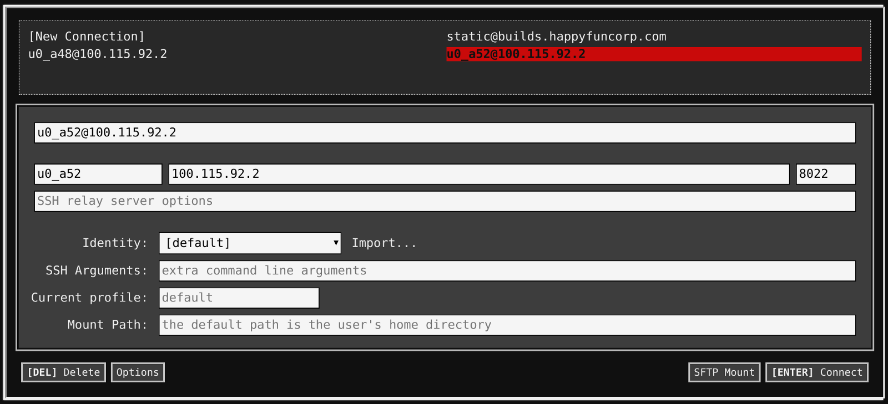

The Pixelbook just feels exciting in my lap, so much lighter and zippier than my MacBookPro. The one that I can’t quite bring myself to upgrade. Lets continue down the path of [setting up this machine as a dev environment](/articles/2017/writing_code_on_a_chromebook/) and see how well we can make it work.

First I should recognize my indebtedness to Kenneth White, who wrote up [a great guide to setting up a secure Chromebook environment](https://blog.lessonslearned.org/building-a-more-secure-development-chromebook/ ""). I’m less security focused than he is, and he goes really deep so check it out.

A quick recap

1. Download `termux` from the Google Playstore
2. `apt get update`
3. `pkg install termux-exec proot util-linux openssh`
4. `termux-setup-storage`
5. `termux-chroot`
6. `mkdir -p /storage/emulated/0/Download/devbox/ssh`
7. `ln -s /storage/emulated/0/Download/devbox /home/devbox`
8.
`ssh-keygen -t rsa -b 4096 -C “wschenk@gmail.com”`(Replace with your email for good sanity.)
9.
`cat /home/devbox/ssh/id_rsa.pub &gt;&gt; /home/.ssh/authorized_keys` (Use the newly created key to log in to the local termux box)
10. `sshd`
11.
`whoami` to get your user name
12.
`ifconfig arc0 | awk '/inet /{print $2}'` to get your up address
13. Install the [Chrome Secure Shell chrome book app](https://chrome.google.com/webstore/detail/secure-shell/pnhechapfaindjhompbnflcldabbghjo?hl=en "")

14. Open a new shell session. Enter in the username ip you found above. Set the port to `8022`. Import the identity that you just created, the private key is in `Downloads/devbox` that you generated above.

## Multiple windows

Having a lot of windows open is pretty key when developing. Termux’s interface is fine, but running Android apps in Chromeos isn’t totally fluid — it “works” for some definition of work, but needs a little help. Running the Secure Shell chromebook app is just a lot easier. Better copy and paste (which I do a lot) and it works with the window manager better. Once you have the app opened up, you can press `cntr-alt-shift-N` to get a new window. Then you can move them around to have a nice coding environment.

One nice thing about this is that Secure Shell is that it copies on select, but `cntr-shift-v` pastes into it.

## This machine is fast

I’ve been resisting upgrading my 2015-era Macbook Pro, so I’m comparing an older top-of-the-line machine with a newer top-of-the-line machine, but this thing is a screamer. The hardware is more exciting than the new Macbooks, and being able to flip this to be a tablet, or into a tent which I’m sure will be great watching videos on an air plane. (A specific use case I know but right now I split my time on planes working or catching up on YouTube, so this is just about perfect for that.)

It requires a facility with Linux to navigate around, so the learning curve is a little funky. I’m going to keep playing around with this for a few more weeks and give you a report on how it goes overall.
