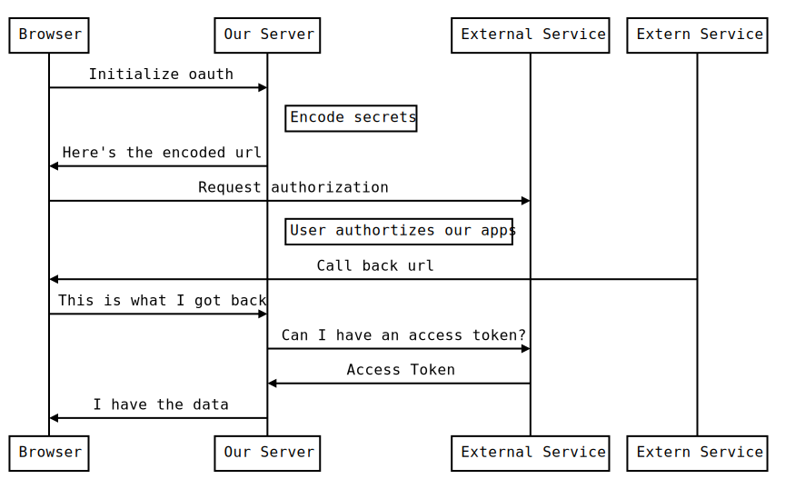

Most of the serverless platforms have their own forms of authentication, but it might not support the specific service that you are looking to use.  Lets go through how we can build a react single page app, hosting on firebase, that talks to the unsplash service directly.  It will be hosted on firebase stoage, and with a tiny bit of firebase functions to tie it together.

## How oauth works

So simple right?
