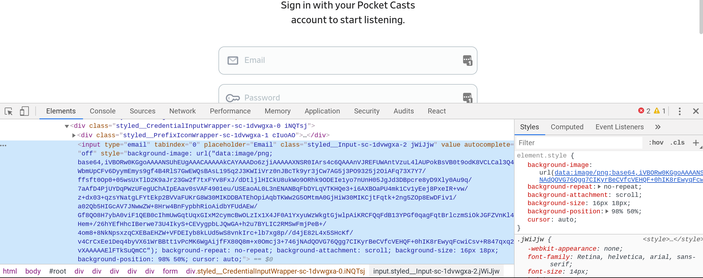
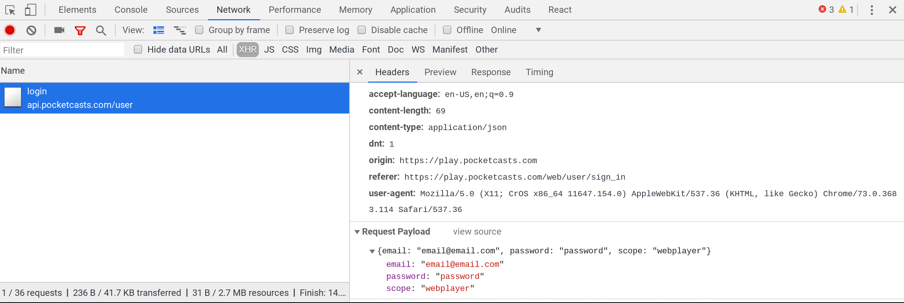
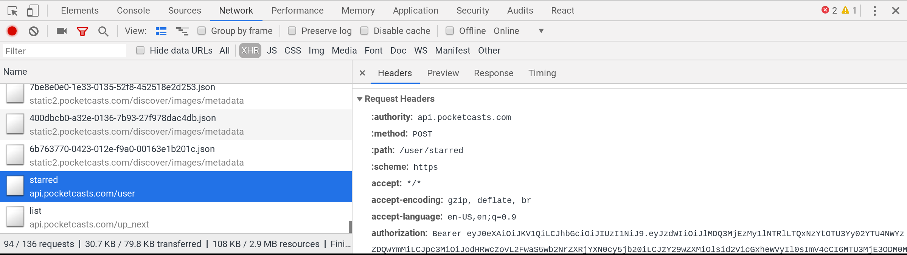
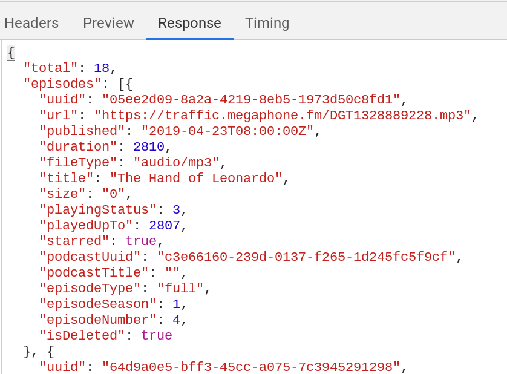
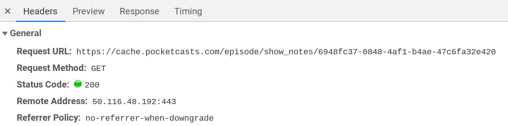

I want to get a list of all of the podcast episodes that I've starred on [PocketCasts](https://www.pocketcasts.com/).  There's no obvious way to export this from the application, and they don't have a published interface.  Lets look at hope to use chrome developer tools to figure out what the API is.

We know that PocketCasts must have an API since it also has a mobile app -- the code in the mobile app must talk to the code in the server using a format that computers understand, which is basically the definition of an API.  We are leveraging the fact that the web version of PocketCasts is a JavaScript client application which uses the same API.  If all the HTML was generated on the server there wouldn't necessarily be an API and so you'd need to resort to scraping and parsing the resulting HTML to regenerate the underlying database that the views were generated off of.  We'll look at using Puppeteer in a later post for situations like that.

## Reverse Engineering a Simple API

The idea is that we are going to open up the chrome developer tools and monitor all of the network requests that the browser makes to the server.  We will stare and ponder at these requests to see how to make them in the same way using our own code.  In this article I'm going to walk through using `bash`, `curl` and `jq`, which are tools available everywhere with very few dependencies.

These particular tools work great, but scripting `bash` is a little bit awkward.  The tools themselves don't really matter, so use which ever coding platform you are most familiar with.  Also, I'm not personally a Firefox user but I'm sure that the developer tools there are top notch and all these techniques apply equally.

## Logging in

The first thing we need to do is go to click the login button and go to the login page to see what's going on.  Click around on the site until you find the login form.  (If you are already logged in, log out first.)  For PocketCasts this should leave you here: https://play.pocketcasts.com/web/user/sign_in  Now we want to [open the developer tools](https://developers.google.com/web/tools/chrome-devtools/open).  You can do this by pressing `ctrl-shift-c`, or right clicking on the page and selecting `Inspect Element`.

<p>

</p>

Looking at this we can see a few things:

1. The `form` has no action, which means that JavaScript is going to be used to submit the form.
2. There's a ton of CSS classes that look like `sytled__`, which means that it's using styled components and react.
3. This means that the CSS classes aren't semantic, which is rude and makes it harder to scrape the data if it comes to that.

Semantic CSS means that when you specify what something looks like on the page you use (hopefully) consistent terms that reflect not just want you want the words on the screen to look like, but that those words are "title of the podcast" or "podcast show notes".  This style is falling out of favor for technical reasons, but it makes it much hard to deal with archiving and dead sites.

This shouldn't matter in this case since the strategy is to emulate the JavaScript client, but it's something to keep in mind when we tackle different sites that are more hostile.

## Select the network tab

Lets key Chrome recording the API requests so we can pull them out.  First select the network tab in the open console.  Then make sure that it's recording (the red dot on the far left) and reload the page.  Enter in your email and password in the form (the screen shot shows me entering `email@email.com` and `password` which is obviously not real) and press submit.

1. The network tab needs to be select.
2. The red dot needs to be on.
3. I've filtered by "XHR", which filters on requests that the JavaScript makes to different servers.  (This stands for XMLHttpRequest which is mostly called Ajax, or "Asynchronous JavaScript and XML", even though we aren't using any XML).
4. I've selected the `/login` request on the left.  You'll probably have a bunch of requests here that you'll need to filter through to find what you are looking for.
4. On the bottom right, you can see the Request Headers (which we need to emulate), the Response Headers (which is what the server sends back) and the "Request Payload", which we also need to send to the server.

<p>

</p>

So lets see what we can see:

1. Under "Headers General" we see that this is a `POST` request to `https://api.pocketcasts.com/user/login` which is the end point.
2. Under "Response Headers" we see that it's sending back JSON, which is always a safe bet for JavaScript applications.
3. Under "Request Headers" -- things that we should be sending to the server -- there are a number of oddities, including headers keys that _start_ with the colon character (`:`).  _Once we connect this is where we will find the authorization mechanism, either as a cookie or a Authorization: Bearer token._

What we see here is that login is done by POST json to `https://api.pocketcasts.com/user/login`. So lets code that up to test.

1. First we put the USER and PASS in the environment.
2. Then we "format" our JSON.
3. `-d` tells curl the data to post
4. `-H` sets the request header telling it that we a posting JSON.
5. `-X` sets the method to `POST`

```bash
$ export POCKET_USER=wschenk@gmail.com
$ export POCKET_PASS=mysuperpassword
$ export LOGIN_JSON="{'email': '${POCKET_USER}', 'password': '${POCKET_PASS}', 'scope': 'webplayer'}"
$ curl -d "${LOGIN_JSON}" -H "Content-Type: application/json" -X POST https://api.pocketcasts.com/user/login | tee token.json
```

If all goes well, you should have a file called `token.json` that looks something like:

```json
{
  "token": "eyJ0eXAiOiJKV1QiLCJhbGciOsomanymanyrandomcharacters",
  "uuid": "e0472133-e54e-4176-also-random-gibberious"
}
```

## Parsing JSON

We need to store that token somewhere and then using it again for making requests.  We can do this by using `jq` to parse this file to be able to use it again.

1. `-r` will print the raw output, without any quotes around it
2. `.token` is the query, which means the token attribute on the top level object.
3. `token.json` is the file that we created above.
4. Lets put it in a variable to use later.

```bash
$ jq -r .token token.json
$ export POCKET_TOKEN=$(jq -r .token token.json)
```

## Getting a list of starred podcasts

Now that we have logged in, lets see how to get the list of podcast episodes that we've starred.  If we click around on the user interface and have the network tab open in the dev tools, we can see all the requests that the client player is making to the API.  If you turn off the filter and show "All" requests you can see that it's really quite a lot!  And it goes to all different servers, not just `play.pocketcasts.com` or `api.pocketcasts.com`.  If you flip over to the "Sources" tab you can see all of the HTML objects that are loaded in from the various servers out there in the world -- fonts and user tracking tend to come from other places.  _This is how they track you_.  This site doesn't have ads but basically if it did then this is the mechanism where your user behavior on the internet is linked together and how the ad networks build a profile on you.   You should install an ad blocker.

Anyway, back to the network tab.  Filter again on "XHR" requests and (probably) reload the page.  You should see something like:

<p>

</p>

1. Again a `POST` request, this time to `https://api.pocketcasts.com/user/starred`
2. There's an `Authorization: Bearer` in the request headers.
3. The request payload is `{}` which is sort of silly but ok.  (This is not really REST, where it should be a `GET` request on the collection object, but when you are writing both the client and the server of a private API you are free to do whatever you want!)
4. If we click over to the "Response" subtab, we get a sense of the data that we are working with:

<p>

</p>

Interesting things to note here:

1. This api uses `uuid` everywhere, in this case for episodes but it also links out to `podcastUuid`.
2. There's a field for `podcastTitle` but no data it in.  You can imagine how when they were developing it they thought it would make sense to include that data, but when implementing the front end nothing that used this api needed it.  So they forgot to either populate the attribute or remove it all together.  No one was intending us to look at it.
3. Alternatively, this is because we are logging with the "webplayer" scope, and if we logged in with a different scope -- like whatever the mobile apps use -- the data will populate.  A mystery that we will skip over.
4. Looks like the `duration` is in seconds.
5. It's weird that `size` is zero for this particular episodes.  Others on my list have a non-zero size, but we know that this data can't be trusted.
6. Looks like it's figuring out that some podcasts have `seasons` and `episodes` -- which I didn't know was an official thing, but doing some googles into RSS feeds shows that this is standard iTunes metadata which is a nifty thing to learn.
7. There's no starred date, or no listening date.  It appears to return the data sorted by when I saved the episode, but I don't know what that date is, only the time that the episode was published on the internet.

In general, data from APIs are messy and annoying.  In many ways it's the same as just scraping the UI, in the sense that the data from the API is what's used to make the UI, the mess is higher upstream.  If it shows up in the user interface you have good reason to believe that it's been tested, but we don't have access to any validation code that the JavaScript uses.  (It's possible to start poking around the minimized JavaScript that you get from the server, but that's for another day.)  What does `playingStatus` mean?  No idea.  Why are some listed as having a zero sized file length?  No idea.  But you need to first look through the data and get a sense of how dirty it is before moving on.

OK, lets look at the `curl` command to pull this data down so we can start playing with it:

1. `-d "{}"` posts the empty JSON.
2. `"Authorization: Bearer ${POCKET_TOKEN}"` is how we pass back the access token.
3. Everything else should look familiar.

```bash
$ curl -d "{}" -X POST \
  -H "Authorization: Bearer ${POCKET_TOKEN}" \
  -H "Content-Type: application/json"  \
  https://api.pocketcasts.com/user/starred > starred.json
```

So now we have a list of episodes that we've starred, but we are missing relavent data -- we don't have the podcast title, the url for it, or any of the show notes!  

## Finding show notes of the episodes

If we click on an episode itself on the website and look through what is being loaded, we can see that it's a `GET` request from a different server.  It's still passing back the Bearer token (which is weird again but I'm going with it.)

<p>

</p>

1. We create a work directory to store all the JSON that we'll get from the server.
2. We'll use `jq` to parse the `starred.json` and pull out the episide `uuid`.
3. We'll loop over those `uuids`
3. We extract out the specific info for this episode into it's own `info.json` file.
4. We hit the API for each show note, putting it into it's own directory.

```bash
for uuid in $(jq -r '.episodes[] | .uuid'  starred.json); do
  mkdir -p episodes/${uuid}

  jq -r ".episodes[] | select( .uuid == \"${uuid}\" ) | ." starred.json > episodes/${uuid}/info.json

  curl \
    -H "Authorization: Bearer ${POCKET_TOKEN}" \
    -H "Content-Type: application/json"  \
    https://cache.pocketcasts.com/episode/show_notes/${uuid} \
    > episodes/${uuid}/notes.json
done
```

## Finding podcast info

Lets look again to see where we can get information about the podcasts.  Looking at the network inspector, we can see that it loads `https://api.pocketcasts.com/user/podcast/list` for the full list of podcast that I subscribe to.  We'll need to pull down this list and then figure out how to combine the information together with the episodes to get the full information.  This is another strange POST instead of GET request.  In this case it's sending `{v:1}` so we will too:

<p>

</p>

```bash
curl -d "{v:1}" -X POST \
    -H "Authorization: Bearer ${POCKET_TOKEN}" \
    -H "Content-Type: application/json"  \
    https://api.pocketcasts.com/user/podcast/list \
    > podcasts.json
```

And lets loop through everything to pull in the data.  We are using to use a loop, one which uses `jq` to pull out the podcast uuid from the file.  We will then call another `jq` query to pull out just the matching JSON block into a file.  There are probably many better ways to do this.

```bash
mkdir podcasts
for podcastUuid in $(jq -r '.podcasts[] | .uuid' podcasts.json)
do
  jq -r ".podcasts[] | select( .uuid == \"${podcastUuid}\" ) | ." podcasts.json > podcasts/${podcastUuid}.json
done
```

## Combining it all together

1. Loop through the starred episodes JSON.
2. Pull out the podcastUuid
3. Wrap the `info.json` file in a `info` attribute and cat to `work.json`
4. Wrap the `notes.json` file in a `notes` attribute and append to `work.json`
5. Wrap the postcast from the previous command into a `podcast` attribute and append to `work.json`
6. Filter `work.json` into `combined.json`
7. Append `combined.json` to `combined_work.json` on the top level.
8. Reformat `combined_work.json` to `starred_combined.json` on the top level.

Here we go!

```bash
> combined_work.json
for episodeUuid in $(jq -r '.episodes[] | .uuid'  starred.json); do
  dir=episodes/${episodeUuid}
  podcastUuid=$(jq -r '.podcastUuid' ${dir}/info.json)

  jq '{episode: .}' ${dir}/info.json > ${dir}/work.json
  jq '{note: .}' ${dir}/notes.json >> ${dir}/work.json
  jq '{podcast: .}' podcasts/${podcastUuid}.json >> ${dir}/work.json

  jq -s 'add | {
    episodeTitle: .episode.title,
    audioUrl: .episode.url,
    published: .episode.published,
    duration: .episode.duration,
    size: .episode.size,
    podcastTitle: .podcast.title,
    author: .podcast.author,
    description: .podcast.description,
    podcastUrl: .podcast.url,
    notes: .note.show_notes }' ${dir}/work.json >> combined_work.json
done

jq -s '. | .' combined_work.json > starred_combined.json
```

## Now you have the full JSON for your starred episodes

From here you can do whatever you want with it, JSON is a form that is easily digestible by many tools.  JavaScript can easily consume it directly, or static site generators often have support for bringing in data like this.  (I did this in a previous post on [pulling down GitHub Stars](../easy_scraping_with_httpie_and_jq/))

Here's the code all put together: [update_pocket_cast_starred.bash](update_pocket_cast_starred.bash)

This pulls everything down into a temporary directory, and then writes the final result into [starred_combined.json](starred_combined.json) that you can use somewhere else for further processing.

That's all for this post. We'll look at using Puppeteer next!
