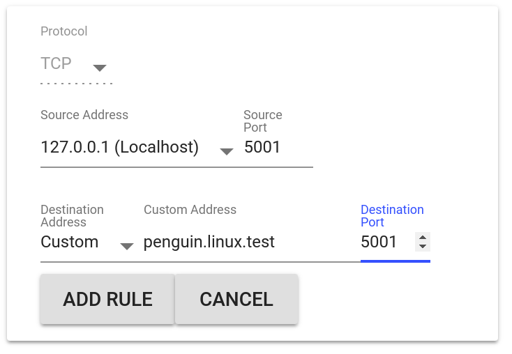

Lets look at how to run an ipfs node on a chromebook.  We are using the linux container for this, and in order to get the experience right we'll need to install some chrome extensions to make it work seamlessly.

IPFS is a [distributed hypermedia protocal](https://ipfs.io) that is a way to access and share data using it's cryptographic key.  This way, it doesn't matter where you get the data from, since you know that if it matches the key, then the data is what you requested.  Once you request the data, you make it available to other computers on the network.  As a result, the data doesn't really live on any particular server, and the more people that access it the faster is it.  Also, the data moves to where people access it, so if you publish something in New York and it becomes popular in New Zealand, the folks in New Zealand will end up downloading it from each other rather than over the underocean cables.

Here's the outline:

1. Download the ipfs binary
2. Init your repository
3. Change the config to open up the linux container to the chromebook
4. Start the daemon
5. Install the chrome extension that maps localhost:5001 to penguin.linux.test:5001
6. Install the IPFS companion chrome extenstion

Lets get started.

## Download IPFS

The [instuctions for installing IPFS](https://docs.ipfs.io/introduction/install/) are pretty simple.  First download the binary from the [prebuilt repository](https://dist.ipfs.io/#go-ipfs), unpack it, and run the install script.

```bash
$ cd /tmp
$ curl -O https://dist.ipfs.io/go-ipfs/v0.4.18/go-ipfs_v0.4.18_linux-amd64.tar.gz
$ tar xzf go-ipfs_v0.4.18_linux-amd64.tar.gz
$ cd go-ipfs/
$ sudo ./install.sh
Moved ./ipfs to /usr/local/bin
```

## Init the repository

```bash
$ ipfs init
```

## Change the config to open up the linux container to the chromebook

We'll need to edit the configuration so that the daemon binds to any network address, rather than being hardcoded to `127.0.0.1`.  Inside of `.ipfs/config` changes the `"Addresses"` stanza so that it looks like this when you run `ipfs config Addreesses`:

```bash
$ ipfs config Addresses
{
  "API": "/ip4/0.0.0.0/tcp/5001",
  "Announce": [],
  "Gateway": "/ip4/0.0.0.0/tcp/8080",
  "NoAnnounce": [],
  "Swarm": [
    "/ip4/0.0.0.0/tcp/4001",
    "/ip6/::/tcp/4001"
  ]
}
```

## Start the Daemon

I'm enabling a few experimental features, but those are optional.  Also, I prefer to have it run manually rather than in a start script, so I'm happy to do this by hand everytime I want to access the network but you may want to look into a writing it as a service to run whenever the container starts.

```bash
$ ipfs daemon --enable-pubsub-experiment --enable-namesys-pubsub

```

## Install connection forwarder

Now we go to chrome and install [the connection forwarder](https://chrome.google.com/webstore/detail/connection-forwarder/ahaijnonphgkgnkbklchdhclailflinn/reviews).  What we want to do is to make "localhost:5001" redirect on the local box to "penguin.linux.test:5001" so that we can look at the web ui.

Once it's installed, select "Add a Rule".  The source address is `localhost:5001`.  For destination, select custom, and have the target address be `penguin.linux.test:5001`.



Now if you go to [localhost:5001/webui](http://localhost:5001/webui) you should be able to see your local node running! Note that you need to keep the Connection Forwarder window open for this to keep working, or manually turn on "run in background"

## Install ipfs companion

Go to the chromestore again and [install IPFS companion](https://chrome.google.com/webstore/detail/ipfs-companion/nibjojkomfdiaoajekhjakgkdhaomnch?hl=en).  Once this is running you should be able to see the number of connected peers in the tab of the browser window:


## And that's it

It takes up a fair amount of ram and slows the computer down a bit, which is why I don't have it running all the time.  But its very fun to experiment with!
