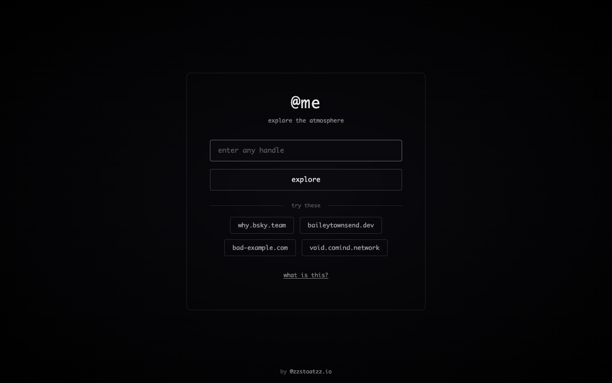
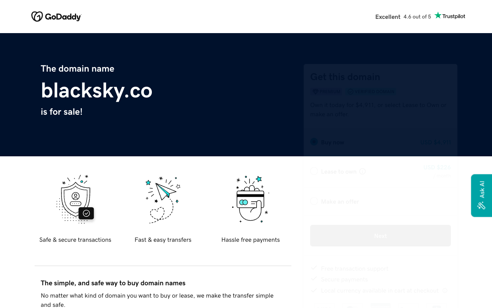
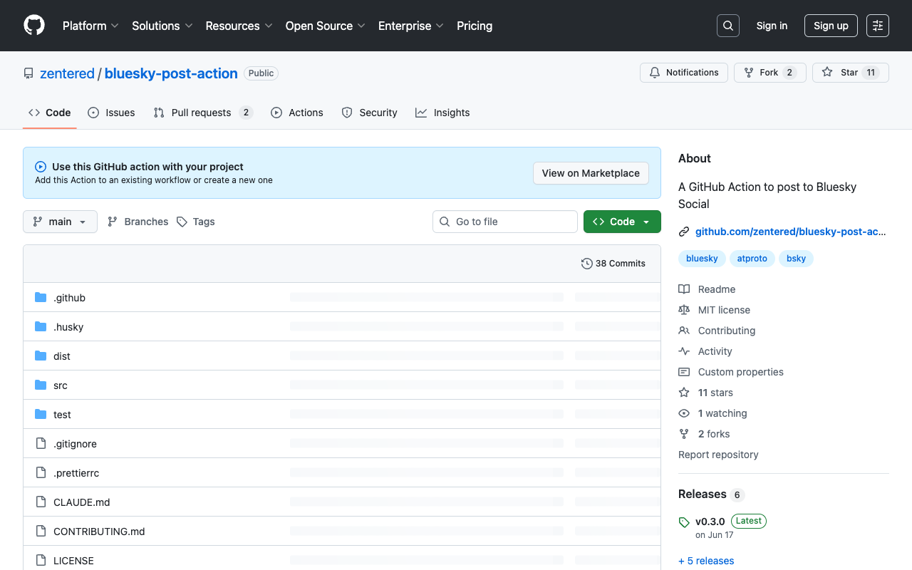
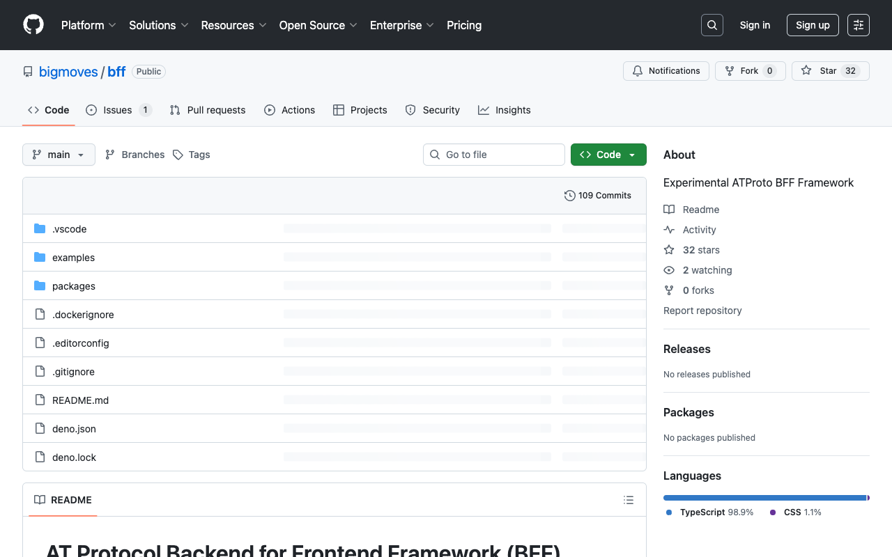
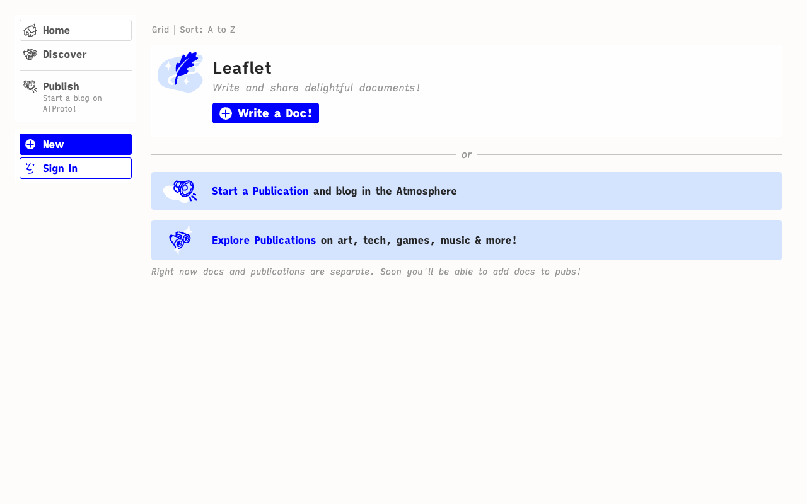
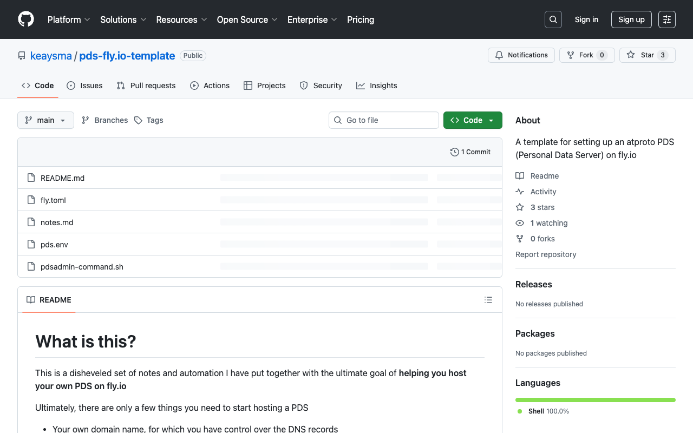
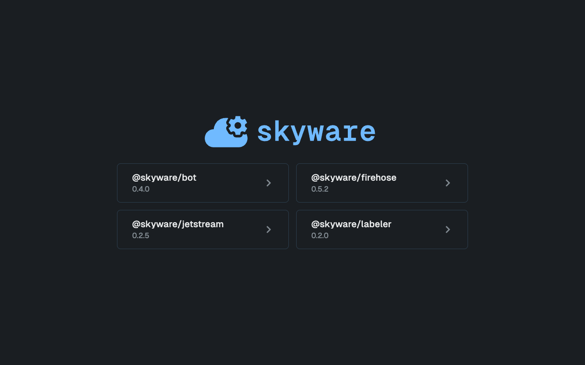
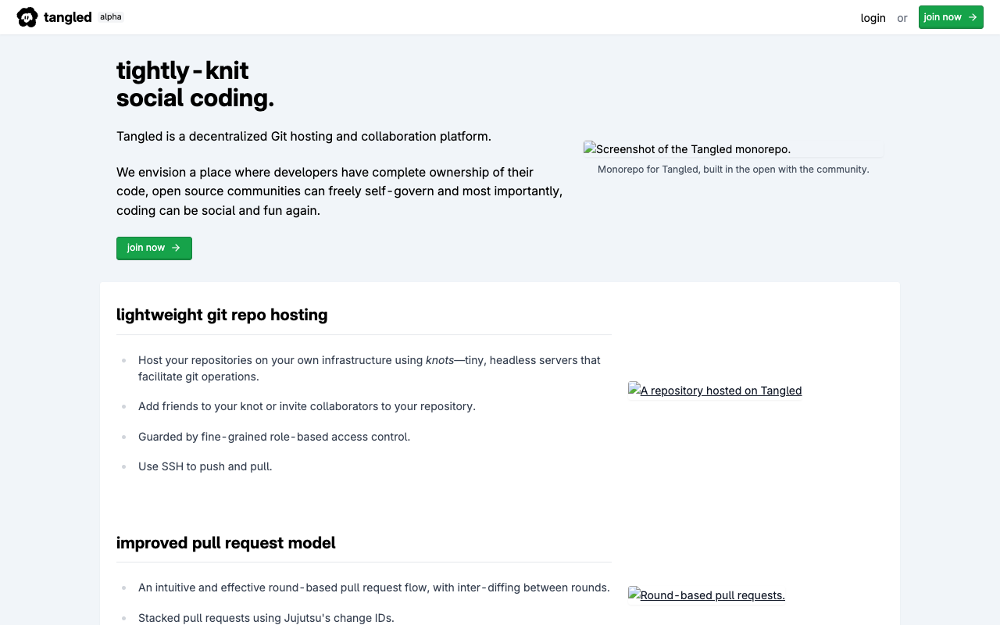
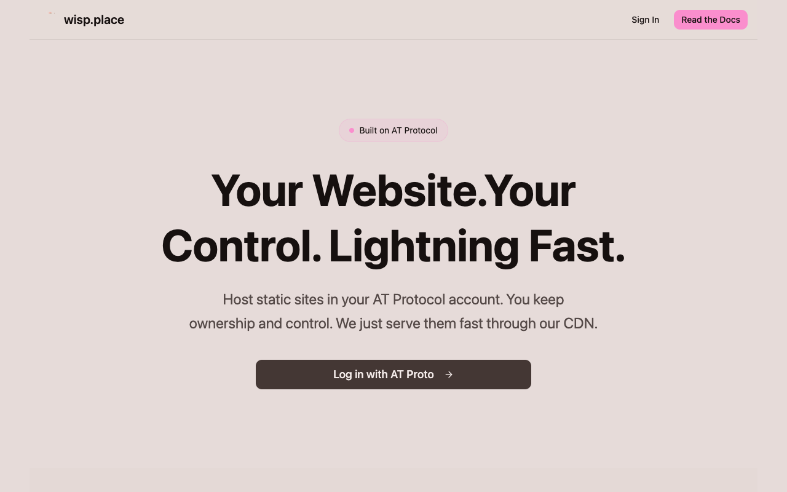

As I've been exploring the AT Protocol ecosystem, I've discovered a fascinating collection of projects that showcase the potential of decentralized social infrastructure. From gamified feed readers to collaborative writing tools, these projects demonstrate creative approaches to building on ATProto.

Here's what I've found that's particularly interesting:

## anisota

https://anisota.net/feed

Anisota is an experimental social media interface for Bluesky and the AT Protocol that gamifies feed consumption by presenting posts as collectible trading cards with rarity ratings, which users flip through in finite decks with stamina limits to discourage compulsive scrolling. It features a nature-themed, calming aesthetic with deck collection mechanics and specimen-gathering gameplay elements, prioritizing slower, healthier consumption patterns over traditional endless-scroll feeds. Created by dame and built on the decentralized AT Protocol infrastructure, Anisota represents a philosophical alternative to venture-backed social platforms.

## at-me

https://at-me.fly.dev/

At-me is a web application that helps users explore the ATProto (Authenticated Transfer Protocol) network by visualizing how personal data is stored across Personal Data Servers. It allows users to enter any ATProto handle to examine how posts, followers, and identity information are decentralized across the protocol, demonstrating how users maintain control of their data compared to traditional centralized social platforms.

## blacksky

Blacksky Algorithms is a decentralized social media infrastructure project built on AT Protocol, reimplemented in Rust as rsky, that empowers marginalized communities (particularly Black users) to govern their own online spaces with democratic control over algorithms, moderation, and resource allocation. Its unique vision centers on the ethical principle that safe spaces for marginalized users create a safer internet for everyone, providing accessible one-click infrastructure tools that put power back in community hands rather than corporate boardrooms. The project prioritizes open-source, cloud-portable architecture that enables communities to remain connected to the wider decentralized network while maintaining complete local autonomy over how they appear, interact, and fund their digital spaces.

## github action

https://github.com/zentered/bluesky-post-action

This GitHub Action automates posting content to Bluesky Social, a decentralized social network. It integrates with CI/CD workflows to publish richtext posts by authenticating with the AT Protocol using your Bluesky credentials. It's useful for automating social media announcements of releases, project updates, and repository events directly from GitHub Actions pipelines.

## BFF

*Experimental ATProto BFF Framework*

https://github.com/bigmoves/bff

BFF is an experimental Deno-based framework for building AT Protocol/Bluesky applications that provides built-in OAuth authentication, real-time data sync via Jetstream, SQLite storage, JSX-based server-side rendering, and interactive UIs with minimal JavaScript using HTMX. It offers a pragmatic alternative to full-stack JavaScript frameworks by combining server-side rendering with components written in TypeScript/JSX, requiring only Deno and a single main.tsx entry point to get started. The framework is particularly interesting for its focus on the Bluesky ecosystem while maintaining a lean, developer-friendly architecture that emphasizes productivity and simplicity over heavyweight dependencies.

## Leaflet

*a tool for shared writing and social publishing*

https://tangled.org/@leaflet.pub/leaflet

Leaflet is a web-based collaborative document editor for shared writing and social publishing that uses Replicache for real-time client-side state management and data syncing, storing publication data on users' Personal Data Servers (PDS) via the AT Protocol used by Bluesky. It implements each text block as a separate editor instance and models data as a graph of facts similar to Datomic, enabling fast, lightweight document collaboration with rich blocks and multi-page support alongside decentralized social publishing features.

## pds-fly.io-template

https://github.com/keaysma/pds-fly.io-template

This repository provides a template for deploying an atproto Personal Data Server (PDS) on fly.io, including configuration files and automation scripts to streamline the setup process. It requires a custom domain with DNS control and handles basic PDS security through JWT secrets and admin passwords, but does not provide OAuth support—instead relying on email verification for user confirmation. The template is infrastructure-focused and designed for single-machine deployments with persistent volume storage.

## grain

*grain.social is a photo sharing platform built on atproto*

https://tangled.org/@grain.social/grain

Grain Social is a photo-sharing social platform built on the AT Protocol that enables decentralized identity and gallery management through a comprehensive monorepo structure. The system combines Deno/TypeScript (77.7%) for rapid web development with Rust (9.8%) for systems-level performance, featuring specialized microservices: AppView (frontend with HTMX and Tailwind), Darkroom (Rust-based image processing), Labeler (content moderation), Notifications (real-time events), and CLI (terminal-based uploads). What makes it technically complete is the separation of concerns across these services while maintaining unified AT Protocol integration, enabling decentralized identity, persistent data storage, image processing, real-time notifications, and multi-platform access all coordinated through a single monorepo.

## skyware

https://skyware.js.org/

Skyware is a TypeScript/JavaScript framework that provides high-level abstractions for building bots and tools on the AT Protocol (Bluesky), offering simplified authentication, event-driven architecture, type-safe classes, and automatic rate limiting instead of requiring direct protocol manipulation. It includes packages for bot development, firehose streaming, Jetstream subscription, and labeler operations, all with zero-setup event handling and convenient helper methods for common tasks. This makes it significantly more accessible than working with low-level ATProto APIs while maintaining full functionality for real-time interactions on Bluesky.

## tangled.org

*tangled is new social-enabled git collaboration platform built on atproto*

Tangled is a decentralized git collaboration platform built on atproto that gives developers complete code ownership and enables data portability unlike GitHub's centralized model. It features advanced collaboration tools like stacked pull requests and a social-enabled workflow, attracting atproto projects because of its alignment with decentralized principles and open data architecture that prevents vendor lock-in. Many atproto community members choose Tangled to self-host their repositories using "knots" (lightweight servers) while maintaining integration with the broader atproto ecosystem for issues, pull requests, and collaborative discussions.

## wisp

*Monorepo for Wisp.place. A static site hosting service built on top of the AT Protocol*

https://tangled.org/@nekomimi.pet/wisp.place-monorepo

Wisp.place is a decentralized static site hosting platform built on AT Protocol that allows users to host websites directly in their personal data server repositories, with files stored as compressed blobs and served via CDN through custom domains or wisp.place subdomains. The full-stack application leverages modern technologies including Bun and Elysia for the backend, React 19 and Tailwind 4 for the frontend, PostgreSQL for data persistence, and a Rust CLI for site deployment. What makes it particularly interesting is its novel approach to combining cryptographic ownership and decentralized infrastructure with practical hosting performance, supporting advanced routing features like Netlify-style redirects while maintaining user sovereignty over their content.

## Conclusion

The AT Protocol ecosystem is rapidly evolving with creative projects that push the boundaries of decentralized social infrastructure. From experimental UIs that challenge our relationship with social feeds to comprehensive frameworks for building the next generation of apps, these projects demonstrate the vibrant community building on ATProto.

What's particularly exciting is the diversity of approaches—from community-governed infrastructure to developer tools, photo sharing to collaborative writing. Each project brings its own perspective on what decentralized social networking can be.
