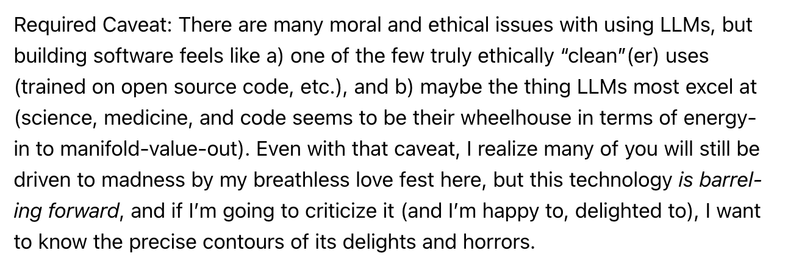

Can you dabble in AI? In the latest [Roden](https://craigmod.com/roden/102/#the-good-place), Craig Mod describes accidentally launching a members-only social network called The Good Place, built with Claude Code in between everything else in his life:

> For a long time now, my taste in software has outstripped my ability to execute (mostly as a function of hours-in-a-day), but now with tools like Claude Code, I'm finding execution and taste are aligning in astounding ways. It's no exaggeration to say that using Claude Code to build The Good Place (and also a bunch of other small tools and projects) **is one of the most astonishing computing experiences of my life**.

*Are we all in on the joke?  I have literally no idea.*

But then at the end, he throws in:

I'm reading this from a maximalist perspective. He's describing having a few tasks completed in between things in his life, while I'm coming from "I have 7 or 8 agents running at all times during the day, and even if I keep going, when will we finally see the limit?"

Basically, he's apologizing for being a wide-eyed fanboy, and I'm so far beyond that — what he's doing looks like dipping a pinky toe into the water.

Using a little AI is like using a little steroids. Why would you ever do it halfway? Once you've decided the tradeoffs are acceptable — and the caveat above is him deciding exactly that — dabbling gets you all of the guilt and none of the gains. If you're going to take it, take the full dose.
