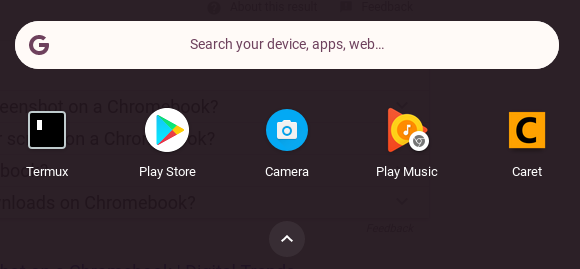
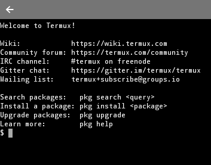
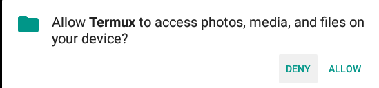
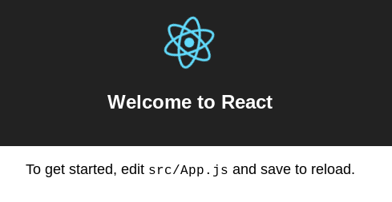
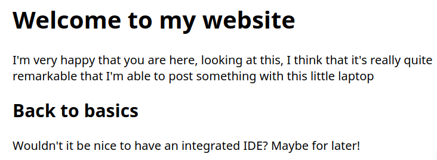
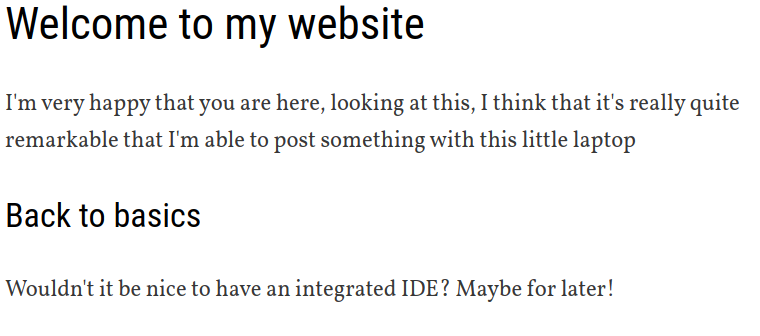

I’ve been disappointed with the latest round of MacBooks and it got me wondering what else it out there. (On the phone side the lack of head phone jack have made me jump ship to Android, which has been liberating.)

Chromebooks are pretty cheap and are super easy to use. I’m writing this on a Asus C100P. It’s small, has a touch screen, and folds into a tablet. There’s no backups to do, no security issues, it turns on immediately and there’s basically nothing to do to keep it working. It syncs up magically with your account, so if it blows up you can just grab another one and there’s little time wasted in fiddling with it to bring your files over. Also, it’s $250! Cell phones are more expensive.

Lets see how to set it up as a development environment. Can we write and deploy websites with this thing?

### Installing Termux

One constraint I have is that I want to leave it as a Chromebook — flipping it into developer mode and installing Linux directly is cool but a different excersize. (Check out [https://github.com/dnschneid/crouton](https://github.com/dnschneid/crouton) if you want to bring a full Ubuntu or Debian environment onto your machine.)

Can we make it work on it’s own terms? The latest version of ChromeOS has access to the Google Play store, and lets you download Android apps to the device. Most apps “work”, in the sense that you can download them and get them to run, but Android tablet isn’t a huge market that developers target so quality is a bit spotty. `Termux`, however, it pretty amazing. It has a linux environment in it, and we’ll be using that to install software and run our development environment. The environment runs inside of the application, which keeps it separate from the rest of the system. This is nice for security but makes interacting with other Chrome-based apps a little difficult. Lets get started!

Open up the Google Play store:

Or go the the installation link directly here: [https://play.google.com/store/apps/details?id=com.termux](https://play.google.com/store/apps/details?id=com.termux).

### Configuring Termux

When you first run the app, it gives you a linux prompt.

This is a linux environment that lets you install software and run some code. First though, lets update the packages to the latest, and get things integrated with your ChromeOS environment. Also check out [the wiki ](https://wiki.termux.com/wiki/Main_Page)for some more useful information.

Termux has great support for hardware keyboards and command options are documented here: [https://termux.com/hardware-keyboard.html](https://termux.com/hardware-keyboard.html)

1. `ctrl-alt-v` for past
2. `ctrl-alt-c` creates a new terminal
3. `ctrl-alt-n` or `ctrl-alt-p` to switch between them

One annoyance is that copy and paste works differently across Chrome and Termux. In chrome, `ctrl-c` and `ctrl-v` copy and paste, but in termux you need to long click to bring up the android copy dialog, and `ctrl-alt-v` pastes the text. Why, Google, why?

Now lets grant termux access to your chromebooks filesystem, so you can write files everywhere.

This creates a folder called “storage” that has links to different parts of the file-system. [More information is in the wiki](https://wiki.termux.com/wiki/Internal_and_external_storage). The filesystem outside of termux behaves slightly differently then it does inside of termux, one main annoyance is that it doesn’t seem to support symlinks. This makes most development a non-starter outside of the sandbox, and limits the ability of other chrome based editors, such as Carat, to access your code. (Someone please show me that I’m wrong about this!)

Then exit out of termux and restart it. `termux-exec` will make it so the shebang path of scripts work correctly. Now we’ll install `nodjse`, `yarn`, and all the usual suspects for a basic `create-react-app` site.

Ok, we are ready to go.

### Creating and running the app

Inside of `termux`, in the internal storage area, run

And let it install everything. There will be an error with `.gitignore` but you can _regular_-ignore that. More symlinking madness.

### Linux inception

`termux` runs a linux environment inside of an Android app that’s running inside of the Chromebook’s OS. `localhost` means something different inside of `termux` than it does in your Chrome browser, so we can’t connect to [http://localhost:3000](http://localhost:3000) when it starts. We’ll need to find out what `termux`’s IP address is, and this is done using `ifconfig`, or interface config:

In my case, this is `100.115.92.2` which you can see in the `inet addr` section under `arc0`. Remember, that `termux` is an Android app running on your Chromebook, and so to copy you long press the mouse to get the selection dialog up. Ok, back to the show.

### Running the server

Now it slowly begins, and you need to point to ip address of the server to load. In my case [http://100.115.92.2:3000/](http://100.115.92.2:3000/) and then you should see:

### Lets do some “development”

Lets install some fonts and styling and just play around. Leave the `termux` terminal running `yarn start` and press `cntr-alt-c` to create a new screen. Inside that window lets install some packages. First, we install `vim` and then open up the main `App.js` file

And replace it with:

Once you `ZZ` to save the file, if you flip back to chrome you should see:

Ok, but those fonts are boring! Lets now add some styling and sweet web-fonts. I’m going to use a `typography.js` theme that you can find here [https://kyleamathews.github.io/typography.js/](https://kyleamathews.github.io/typography.js/) just to keep things simple.

We are going to use the webfont loader from typekit so that the page gets rendered first with the fonts that are available, and once our custom font is loaded from the internet it adjusts in place.

Add the following lines to `src/index.js` after the last `import`:

Now flip back to your page and you should see:

### Lets deploy it

There’s obviously a lot more you could do with that, but lets deploy this app right now and get it onto the internet for people to see. We’re going to use `surge.sh` for this.

This will walk you through creating an account if you don’t have one, and show you the progress of the upload and where the code went

You should see a different url from that, and when you visit it you should see your site.

### Living on the cloud

So there you have it, step by step instructions on how to publish your first website from a cheapo chromebook for free. There are a couple of things that are a challenge with this, mainly that you are working inside of a linux environment segmented from the rest of the chromebook. This mean, in effect, that you need to learn `vi` to get anything done. Its a great tool and worth learning, but it does have quite a learning curve.

We should setup git and connect to github to make this more realistic, but I’ll leave that for now. It’s pretty exciting what can be done. This is a local environment that could be used without network connectivity, on an airplane, or somewhere where there’s spotty wifi service. It has all the security updates and security that Google provides, so you don’t need to worry about much.

Its very easy to wipe the machine if needed. Leaving some cheap machines around to pick up and use if and as needed works, it’s no longer something precious. If your source code is stored in git, which it should be, then swapping computers becomes easy. Your web environment gets synced over without having to spend a lot of time downloading and configuring, and so your laptop becomes a brief places where data comes down from the cloud, lets you work on it locally, and then it all fades away when you aren’t using it.

It’s not quite as powerful as a “real laptop” but it works!
