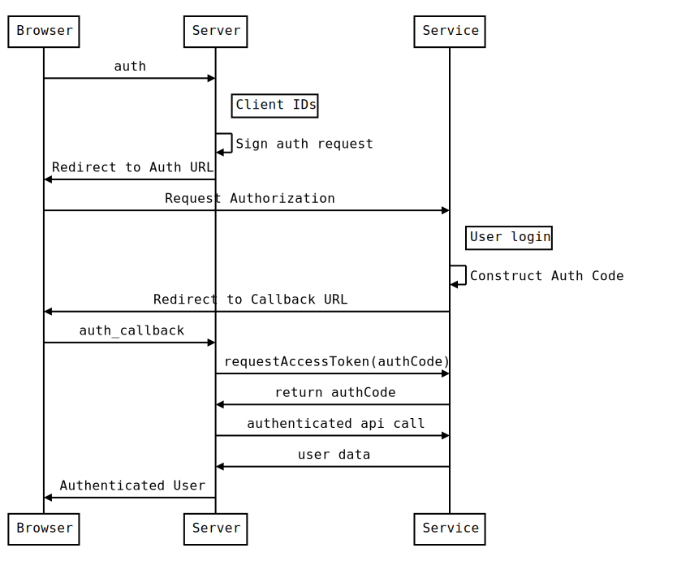
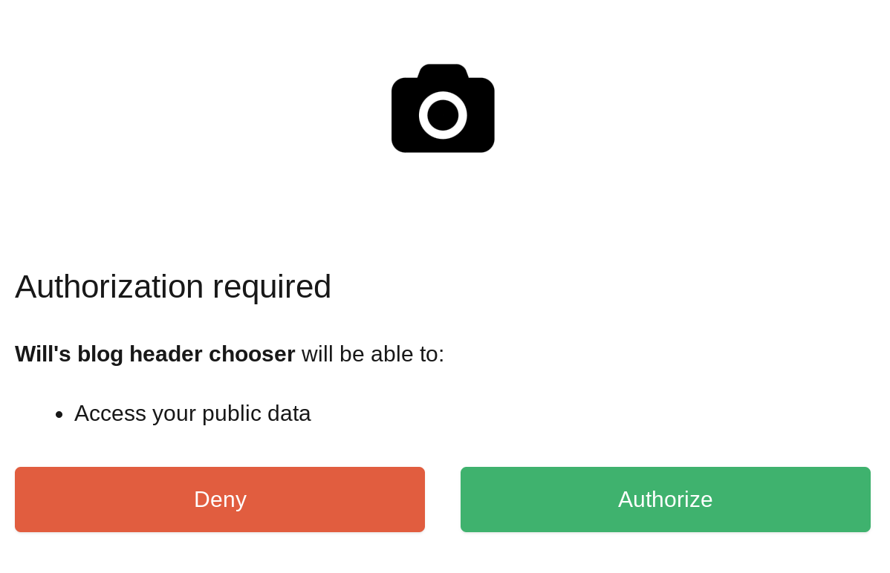

Most of the serverless platforms have their own forms of authentication, but it might not support the specific service that you are looking to use. Lets go through how we can build a react single page app, hosting on firebase, that talks to the unsplash service directly. It will be hosted on firebase stoage, and with a tiny bit of firebase functions to tie it together.

## How oauth works

Here is the overall process:



There are 3 entities -- the user's browser, our server, and the third party service.

1. On user action, such as pressing a Log in With Google button, a request is made to your server.
2. A signed request is generated which includes the access levels that we wish to be granted. The client ID and client secret, which are provided by the service provider (under something like Create An App) are used to sign this request so that the server knows which app is requesting permission.
3. The browser is redirected to the third party service with this request.
4. The user interacts with the third party service, and grants us the permission.
5. The browser is redirected to the "call back url", which is generally needs to be white listed at the same place you got your client id and secrets.
6. The authcode is then used by our server to request an access_token from the service. authcode are very short lived so prevent play back attacks since they are exposed to the browser. Access tokens are longer lived and aren't generally exposed to the browser.
7. The server (optionally) gets information for the account, for example name and avatar photos, to configure a local account.
8. A logged in version of the site is returned to the user's browser.

In this scenario:

1. The user's password is never seen by our server.
2. The user doesn't need to remember yet another password for your site.
3. The access token is never seen by the user.
4. Access Tokens can be revoked by the third-party service at any time.
5. Access Tokens can be tied to a developer, so bad actors on the server level can be locked out.
6. The third party service can grant fine grained control of what data they grant access to.

## What do we need to implement

1. A client ID from the third party service.
2. A client secret from the third party service.
3. An auth method to contruct the initial requests.
4. An auth_callback method to process the final request.
5. An auth callback url that is granted access by the third party service's app configuration.

The first 2 are created at a third party service. For this example, I'm going to choose [firebase](https://firebase.google.com/) to host our functions and website, and [Unsplash](https://unsplash.com/developers) since it's a pretty fun third-party service that's a bit off the beaten path and its not too hard to get an app registered.

### Create the app on the third party service

Go ahead and follow that the unsplash link and register as a developer.

Then press the big `New Application` button and verify that you are going to follow the rules. Give your application a name and a quick description, then create!

Note your Application Key and Secret. This could aslo be called your client id and secret. We'll need those later. Set your callback url to `https://localhost:3000/auth_callback`. Once we deploy to firebase we'll need to go back with our actual URL, but this is what we'll use fore testing.

### Create our javascript template

We are going to use `create-react-app` and then going to add firebase to it.

```bash
$ npx create-react-app unsplash-test
$ cd unsplash-test
```

### Setup firebase

Now we setup our "server" on the [FireBase console](https://console.firebase.google.com/u/0/) Create a new application. Select the web integration, and copy the example config into `src/firebaseConfig.js`, something like below:

```js
var config = {
  apiKey: "AIzY....",
  authDomain: "honey-b6642.firebaseapp.com",
  databaseURL: "https://honey-b6642.firebaseio.com",
  projectId: "honey-b6642",
  storageBucket: "honey-b6642.appspot.com",
  messagingSenderId: "847930143737",
};
```

If you haven't already, it's time to install the `firebase-tools` page. I'm using yarn here:

```bash
$ yarn global add firebase-tools
```

And then lets add firebase to our project:

```bash
$ yarn add firebase
$ firebase login
$ firebase init
```

This will first prompt you to login to firebase so your machine has development credentials. Then `init` will configure your local project with the correct configuration.

1. Select at least functions and hosting.
2. Choose the application that you just created.
3. I chose JavaScript instead of TypeScript.
4. Yes to ESLint.
5. Yes to install dependencies.
6. `build` as the hosting directory.
7. Yes to single page app.
8. No to overwriting `index.html` if asked.

Firebase should now be configured. Lets do a quick test of the deploy.

```bash
$ yarn run build # Build the sample create-react-app project
$ firebase deploy # Push everything to firebase
```

And open your browser to the url that was `firebase deploy` spit out at the end. If you see a blank screen, double check that in `firebase.json` you have `build` set as the `public` directory in hosting.

### Set the secrets for your firebase functions

We are going to store the oauth secrets inside of firebase to keep them seperate from your code. These are the application id and application secret that we got from unsplash above that you should have taken note off. Lets set those in firebase now (and be sure you enter in your own secrets!)

```bash
$ firebase functions:config:set oauth.client_id=yourclientid
$ firebase functions:config:set oauth.client_secret=yourclientsecret
```

We can then pull these secrets back down locally into a firebase env file so that when we are testing out our firebase code it will behave like it will in production.

```bash
$ firebase functions:config:get > functions/.runtimeconfig.json
```

We don't want these files to go into git so

```
$ echo functions/.runtimeconfig.json >> .gitignore
```

### Setup firebase functions

Lets go into the `functions` directory and add a few npm modules. One for the http, and the other for the oauth flow.

```bash
$ cd functions
$ yarn add express
```

Now lets create a simple app that we can use to test out our install. Replace `functions/index.js` with:

```js
const functions = require("firebase-functions");
const express = require("express");

const oauth = functions.config().oauth;
const webApp = express();

webApp.get("/auth", (req, res) => {
  res.send("my client id is: " + oauth.client_id);
});

exports.oauth = functions.https.onRequest(webApp);
```

Then run `firebase serve --only functions` to start up the api locally. Be sure to check out the url that the proxy code is running on. In my case, it's `http://localhost:5001/honey-b6642/us-central1/oauth`. Once this is running you should be able to go to the url listed and see the client id from the configuration.

## Setup the react app

We need to point our react code to our firebase functions, and we are going to put that information into `env` files so that there is one place to swap them out later. These need to be prefaced with `REACT_APP_` in order to play well with the `create-react-app` build process. Create a `.env.development` file with your information in it

```
REACT_APP_BASE_URL="http://localhost:5001/honey-b6642/us-central1/oauth"
```

We also don't want this file in source control:

```bash
$ echo .env.development >> .gitignore
```

Once we deploy the server to fire base, we can point this to our production instances. Also, we will create another `.env.production` file for build time information. Note that we don't want the oauth secrets here, since this is for the JavaScript code, not for the server functions.

First lets add some small styling to that our eyes won't hurt during development.

```bash
$ yarn add node-sass bootstrap reactstrap dotenv
```

Rename `src/index.css` to `src/index.scss`, and include the bootstrap sass files. This is a bit overkill at the moment, but it will set things up for easy customization going forward.

```scss
@import "~bootstrap/scss/bootstrap.scss";
```

Be sure to update `src/index.js` to point to the correct style sheet, change `index.css` to `index.scss`

Now we can build out a scaffolding for `src/App.js`:

```jsx
import React, { Component } from "react";
import { Jumbotron, Container } from "reactstrap";

const LoginWindow = (props) => {
  return (
    <Jumbotron>
      <Container>
        <h1 className="display-3">Unsplash browser</h1>
        <p className="lead">
          This is an example of how to do something amazing
        </p>
        <p>
          <a
            className="btn btn-primary"
            href={process.env.REACT_APP_BASE_URL + "/auth"}
          >
            Connect
          </a>
        </p>
      </Container>
    </Jumbotron>
  );
};

class App extends Component {
  render() {
    return <LoginWindow />;
  }
}

export default App;
```

Now start up the server using `yarn start`, and press the `Connect` button. You should now see the response from the firebase function running locally!

## Implementing the OAuth Flow

Now that all the pieces are in place, it's time to start implementing the oauth logic inside of the firebase functions.

First lets add a few libraries to the `functions/package.json`:

```
$ cd functions
$ yarn add simple-oauth2 randomstring
```

Also edit the local `functions/.runtimeconfig.json` to include the callback url that we are going to pass to unsplash. Mine looks like:

```json
{
  "oauth": {
    "client_secret": "56efa3a9c3ddc8ff50beab6.....",
    "client_id": "d69d777a78a53b95523cc4cbf.....",
    "redirect_uri": "http://localhost:5000/honey-b6642/us-central1/oauth/callback"
  }
}
```

Now lets write some code! Lets replace what we have in `functions/index.js` with a method to create a authorization request to unplash and then redirect the user's browser to it.

```js
const functions = require("firebase-functions");
const express = require("express");
const simpleOauth = require("simple-oauth2");
const randomstring = require("randomstring");

const oauth = functions.config().oauth;
const webApp = express();

const oauth2 = simpleOauth.create({
  client: {
    id: oauth.client_id,
    secret: oauth.client_secret,
  },
  auth: {
    tokenHost: "https://unsplash.com/",
    tokenPath: oauth.token_path || "/oauth/token",
    authorizePath: oauth.authorize_path || "/oauth/authorize",
  },
});

webApp.get("/auth", (req, res) => {
  const authorizationUri = oauth2.authorizationCode.authorizeURL({
    redirect_uri: oauth.redirect_uri,
    scope: oauth.scopes || "public",
    state: randomstring.generate(32),
  });

  res.redirect(authorizationUri);
});

exports.oauth = functions.https.onRequest(webApp);
```

First we setup `simpleOauth`. We are using the configuration id and secret that we got from unsplash, and the endpoints that are specified in the documentation for the `token` and `authorize` path. When we get a `/auth` request we use create an authorization request using that configuration and then redirect the browser to it.

We haven't written a callback handler yet, but lets try it out. First go to [unsplash](https://unsplash.com/) and log out of your account to see the whole flow. Then go to http://localhost:3000 and press the auth button. You'll be prompted to log in, and when you do you should see:



If you don't, a couple of things to check

- Is your client id and secret being set correctly?
- Is your redirect_uri configured correctly?
- Are you passing the correct scope? (In this case, `public`)

OK, now it's time to write the callback method!

```js
webApp.get("/callback", (req, res) => {
  console.log(req.query);

  var options = {
    code: req.query.code,
    scope: oauth.scopes || "public",
    redirect_uri: oauth.redirect_uri,
  };

  return oauth2.authorizationCode
    .getToken(options)
    .then((result) => {
      const token = oauth2.accessToken.create(result);

      // We could also ask unplash about the user profile here if we wanted
      // to setup a firebase user for this authorization
      res.setHeader("Content-Type", "application/json");
      return res.send(JSON.stringify({ token: token.token.access_token }));
    })
    .catch((error) => {
      console.error("Access Token Error", error.messsage);
      res.send(error);
    });
});
```

When you press "Grant Access" on Unsplash, it will generate an authorization code and redirect the user's browser back to this function. Here we use that code to get an access token from unsplash that we can then use to make requests on the user's behalf.

## Using the token

In the scenario we outlined at the top, the server would store the access_token and connect to the server with authenticated requests from there. In the case of firebase, we'd great something like an Anaonymous account, store the token there, and then proxy requests from the server to the third party service never exposing the access_token to the browser. This is a clean way to do this so that the access_token is never exposed.

But it makes it more complicated, so we are going to hack through it for demo purposes to just finish up the demo. The code that we are writing is going to connect to the unsplash api from the browser directly, so we'll change our fireback function code to redirect back to our static app with an url that contains the access_token.

So, lets have the code redirect back to our react site with the query string as the parameter.

First lets add where we'd like it to go to the configuration in `functions/.runtimeconfig.json`:

```json
{
  "oauth": {
    "client_secret": "56efa3a9c3ddc8ff50beab69bd530....",
    "client_id": "d69d777a78a53b95523cc4cbf8921....",
    "redirect_uri": "http://localhost:5000/honey-b6642/us-central1/oauth/callback",
    "static_site_url": "http://localhost:3000"
  }
}
```

Then lets change our function to redirect instead of spitting out json. So in `functions/index.js` change:

```js
res.setHeader("Content-Type", "application/json");
return res.send(JSON.stringify({ token: token.token.access_token }));
```

to:

```js
return res.redirect(
  oauth.static_site_url + "?access_token=" + token.token.access_token
);
```

Now we need to update our react code so that it knows what to do with that access token. Lets first add a node module that understands how to parse query strings:

```bash
$ yarn add query-string
```

And replace the App class in `src/App.js` with the following:

```jsx
class App extends Component {
  state = { access_token: null };

  componentDidMount() {
    const values = QueryString.parse(window.location.search);

    if (values.access_token !== undefined) {
      console.log("looks like we've got an access_token!", values.access_token);
      this.setState({ ...this.state, access_token: values.access_token });
    } else {
      console.log("No token");
    }
  }
  render() {
    if (this.state.access_token) {
      return <Unsplash access_token={this.state.access_token} />;
    } else {
      return <LoginWindow />;
    }
  }
}
```

We need to create that `Unsplash` component, so lets do that now inside of `src/Unsplash.js` (and don't forget to `import` this at the top of `App.js`!)

```jsx
import React from "react";
import { Container, Progress } from "reactstrap";

const authedGet = (access_token, endpoint) => {
  const headers = {
    Accept: "application/json",
    "Content-Type": "application/json",
    "Accept-Version": "v1",
    Authorization: `Bearer ${access_token}`,
  };
  console.log("headers", headers);
  const fetchInit = {
    method: "GET",
    headers,
    credentials: "omit",
  };
  return fetch("https://api.unsplash.com" + endpoint, fetchInit);
};

const Loading = () => {
  return (
    <Container>
      <h1>Fetching from the unsplash api</h1>
      <Progress animated color="primary" value={100} />
    </Container>
  );
};

const Profile = ({ user }) => {
  return (
    <Container>
      <h1>Hello {user.name}!</h1>
      
    </Container>
  );
};

export default class Unsplash extends React.Component {
  state = { loading: true };

  componentDidMount() {
    const { access_token } = this.props;

    authedGet(access_token, "/me")
      .then((response) => {
        console.log("Got response " + response.status_code);
        return response.json();
      })
      .then((data) => {
        this.setState({ loading: false, user: data });
      });
  }
  render() {
    if (this.state.loading) {
      return <Loading />;
    } else if (this.state.user) {
      return <Profile user={this.state.user} />;
    } else {
      return <p>Horrible error</p>;
    }
  }
}
```

The first thing that we are doing is creating a utility function that uses the `fetch` function and passes the `Bearer` token, a/k/a `access_token` to the api. In the `componentDidMount` method of the `Unsplash` class, we use that function to initiate the request. Once we get that data, we show the rather bare bones `Profile` component that has a name and a picture in it.


Proof of concept: working locally!

## Deploying everything to firebase

Now lets package this up to run on production. First we need to tell the react app where the firebase functions are. Go to the [FireBase Console](https://console.firebase.google.com), select your project, and find the functions admin panel on the left side. See where the are deployed. Mine is `https://us-central1-honey-b6642.cloudfunctions.net/oauth`, so in `.env.production` lets add:

```
REACT_APP_BASE_URL="https://us-central1-honey-b6642.cloudfunctions.net/oauth"
```

Now lets kick off a production build of the react app:

```bash
$ yarn build
```

Now we need to setup the config for the firebase functions. Lets make sure that we have an entry for everything that is in our `functions/.runtimeconfig.json` file. First set the static_site_url value to the url you are looking at, in my case `https://honey-b6642.firebaseapp.com/`

```bash
$ firebase functions:config:set oauth.static_site_url=https://honey-b6642.firebaseapp.com/
```

For the redirect_uri, use the same as the `REACT_APP_BASE_URL` above but add `/callback`. Mine is `https://us-central1-honey-b6642.cloudfunctions.net/oauth`, so

```bash
$ firebase functions:config:set oauth.redirect_uri=https://us-central1-honey-b6642.cloudfunctions.net/oauth/callback
```

Once that is done, lets push both the html/css/js code as well as the functions to firebase:

```bash
$ firebase deploy
```

If you have the [problem listed here](https://github.com/firebase/firebase-tools/issues/775), update `functions/package.json` to downgrade `simple-oauth2` to `^1.6.0`, return `yarn` in the `functions` directory, and retry the firebase deploy.

Finally, we need to whitelist our callback URL inside of the [Unsplash Application](https://unsplash.com/oauth/applications). Follow that link, select your application, and add that same callback url from above after the localhost one that should already be there.

Now lets test it out! Make sure that you have billing enabled in FireBase, otherwise you won't be able to make external requests and you will get a host not found error.

## Final thoughts

The code is available on GitHub here: https://github.com/wschenk/unsplash_api_firebase

We've covered a lot of ground here!

1. Overview of the OAuth protocol
2. Hosting a static create-react-app site on firebase
3. Building firebase functions and testing them locally
4. Environment config with create-react-app in production and development
5. Environment config with firebase functions, also in production and development
6. Using `simple-oauth2`
7. A quick and easy way to pass the access_token back to our react app
8. How to use the `Bearer` token using `window.fetch` to get authenticated data from an API.

---

### References

1. https://github.com/wschenk/unsplash_api_firebase
1. https://firebase.google.com/docs/functions/get-started
1. https://firebase.google.com/docs/functions/local-emulator
1. https://www.netlify.com/blog/2018/07/30/how-to-setup-serverless-oauth-flows-with-netlify-functions--intercom/
1. https://github.com/Herohtar/netlify-cms-oauth-firebase
1. https://unsplash.com/documentation
1. https://github.com/unsplash/unsplash-js
