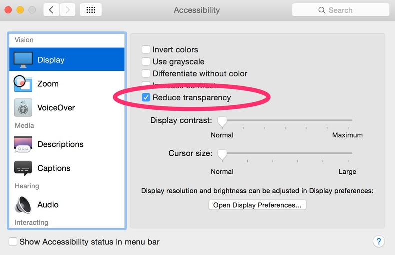
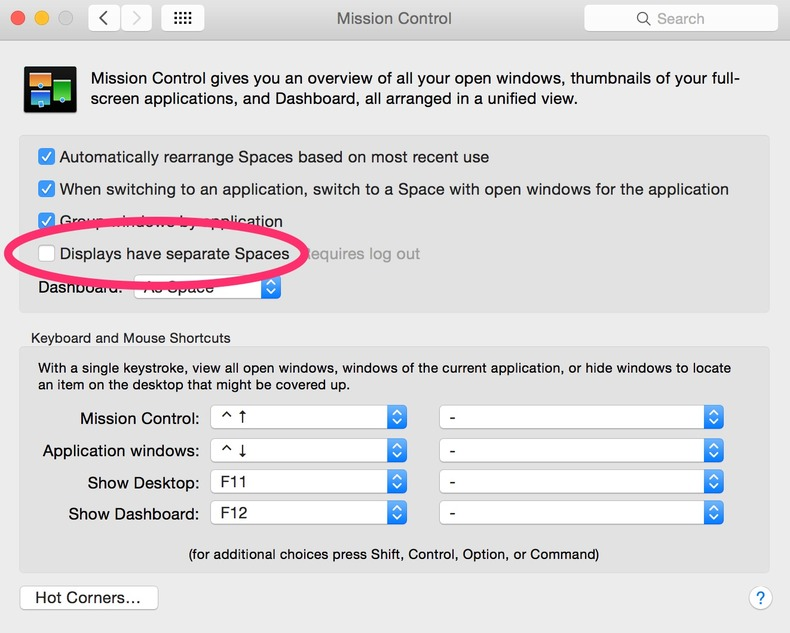

Since I've upgraded to Yosemite my computer has gotten slower and slower. When it first boots up, it is it's old fast self, but after a few hours everything slows down. Remember the days when you needed to restart your computer to keep it working well? I had forgotten, and I wasn't really into remembering it.

I also upgraded to [Airmail 2](http://airmailapp.com). I get a ton of email and it used it be a lot faster than using Mail.app, but now I'm typing ahead of what the program can handle and it was driving me crazy. My machine is less than a year old and it's basically maxed out, so its preposterous to think that it was the hardware!

The only evidence I could find was that the `WindowServer` process was taking up more CPU as time went on. WindowServer is the part of OSX that is responsible for drawing the display. There seems to be something wrong with it in the current build, and there's something about Airmail's awesomeness that is [exacerbating the problem](https://airmail.tenderapp.com/help/discussions/airmail-beta-259/46-windowserver-40-cpu-os-x-yosemite-becomes-sluggish).

## Reduce Transparency

There are two things to do to fix this. First go to _System Preferences > Accessibility_ and select _Reduce Transparency_:

Transparency is most noticeable in the menu bar and window titles. It's a nice effect, but this option will go away. This matter less than you think, because instead of staring at the pretty pictures while you are waiting switching between windows, you'll just be _doing what you intended to do._

## Displays have separate spaces

Then go to _System Preferences > Mission Control_ and turn off _Displays have separate Spaces_:

You'll need to logout and log back in for the changes to take effect. If you have an external monitor plugged in this will make it into more of a mirrored effect. But it's less memory for the WindowServer to have to deal with but frankly, for this build, it seems like the WindowServer is in over its head.

_Image source: [Jose Hidalgo](https://www.flickr.com/photos/enfocalafoca/10281990664/in/photolist-bemZsr-eTiVKj-7mHDny-9Dy4ax-oCTxUN-6ADKkQ-gEzTB7-9JVCCh-9VBzew-e6drjv-81i16E-dZELmS-9W3aAW-fxk247-bUjtvd-5B9RWQ-haJUc-7PGVs-2bhCy-hiECct-9TdDF5-dxPUZS-k4Cqht-Eybma-dfUT1w-nHgvih-fimRJN-kgE-eTifLY-koWW78-9Mi2sf-fCy2Gj-oR5RdZ-aivjjh-YKHt3-nSa2xB-9KrnK7-j3hzch-7Ry3aQ-Be2KQ-7uyD2-aqbv5m-84hTGU-88gVVn-7yf7Ao-nYeUkp-du6QC8-duy9pH-dGMeu2-2ve91)_
